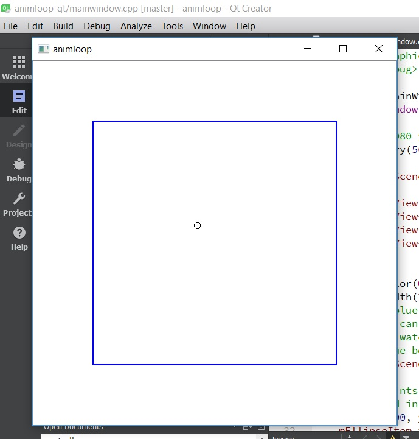

# animloop-qt

**This code is a simple example of one way to do a minimal QGraphicsScene animation in Qt.  This does not use QML.**

In this example, a circle moves downwards and to the right.  The blue box depicts the boundary of the QGraphicsScene, and the window dimensions are about what the QGraphicsView dimensions are.  A 60ms signal/slot timer is used to fire off each tick of the animation loop.  

For beginners, play with the setGeometry values for the scene and the view in mainwindow.cpp to get an idea of how they relate to each other, when scrollbars appear, etc.  Also notice that the circle will still be rendered in the view, even when it leaves the dimensions the scene had when it was instantiated.

Another fun task for beginners would be to make the circle "bounce" off the scene boundary, so that it stays within the blue box.

This code is copyright 2017 isc1 and is free for anyone to use under the MIT license.  This code was written on Desktop Qt 5.9.0 MinGW 32-bit, and may not build on later versions of Qt without modification.

**THIS CODE IS UNSUPPORTED and no one is available to respond to questions or comments about it.**