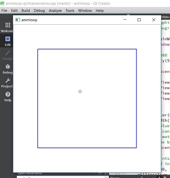

# animloop-qt

**This code is a simple example of one way to do a minimal QGraphicsScene animation in Qt.  This does not use QML.**

In this example, a circle moves downwards and to the right.  The blue box depicts the boundary of the QGraphicsScene, and the window dimensions are 100 pixels larger than the QGraphicsView dimensions.  A 60ms signal/slot timer is used to fire off each tick of the animation loop.  This code has been kept simple in a small number of files to make it beginner-friendly.

For beginning programmers, try playing with the setGeometry values for the scene and the view in mainwindow.cpp to get an idea of how they relate to each other, when scrollbars appear, etc.  What happens when you make the scene bigger than the view?  What happens when you make the window smaller than the view, and/or the scene?  Change the values and see what happens.  Also notice that the circle will still be rendered when it leaves scene edge, but it disappears when it leaves the view edge.

Another fun exercise for beginners would be to make the circle "bounce" off the scene boundary, so that it stays within the blue box, or add other moving circles, or otherwise change the animation somehow.

_This code is copyright 2017 isc1 and is free for anyone to use under the MIT license.  This code was written on Desktop Qt 5.9.0 MinGW 32-bit (Windows), and might not build successfully on later versions of Qt, or on other platforms such as Linux or MacOS, without modification._

THIS CODE IS UNSUPPORTED and no one is available to respond to questions or comments about it.
-----

If you are new to Qt, try the following links.  (None of these links are affiliated with this repository or it's author in any way.)
* [https://ics.com/blog/getting-started-qt-and-qt-creator-windows](https://ics.com/blog/getting-started-qt-and-qt-creator-windows) nice walkthrough with screenshots by ics, includes how to install Qt
* [https://wiki.qt.io/Basic_Qt_Programming_Tutorial](https://wiki.qt.io/Basic_Qt_Programming_Tutorial) nice tut with screenshots!
* [https://doc.qt.io/qtcreator/creator-getting-started.html](https://doc.qt.io/qtcreator/creator-getting-started.html) official getting started page
* [https://doc.qt.io/qt-5/gettingstarted.html](https://doc.qt.io/qt-5/gettingstarted.html) Qt 5 getting started info
* [https://www.youtube.com/watch?v=6KtOzh0StTc&list=PL2D1942A4688E9D63](https://www.youtube.com/watch?v=6KtOzh0StTc&list=PL2D1942A4688E9D63) Nice Qt video library, some older videos have outdated info, however.